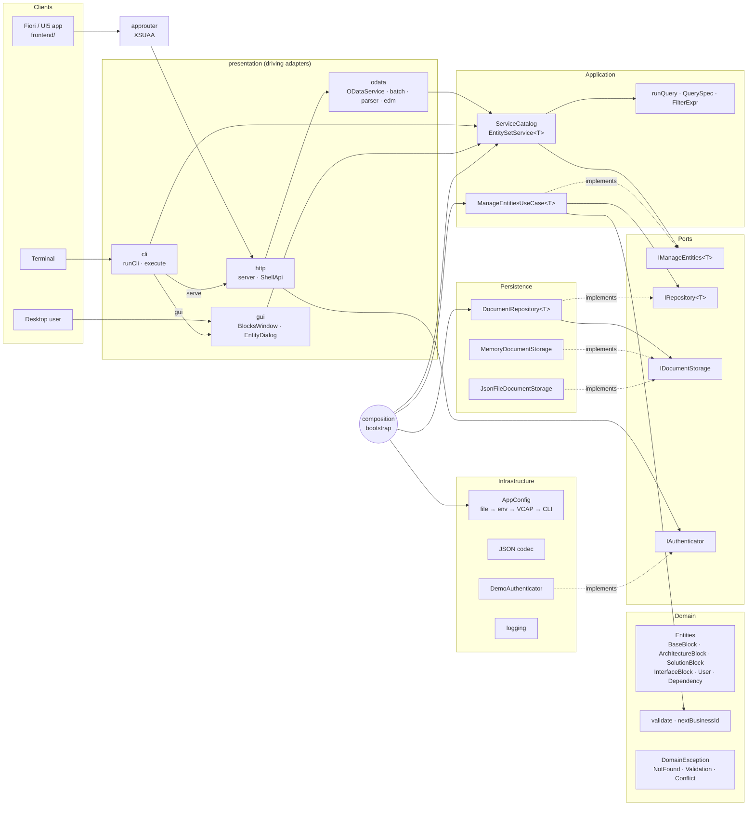
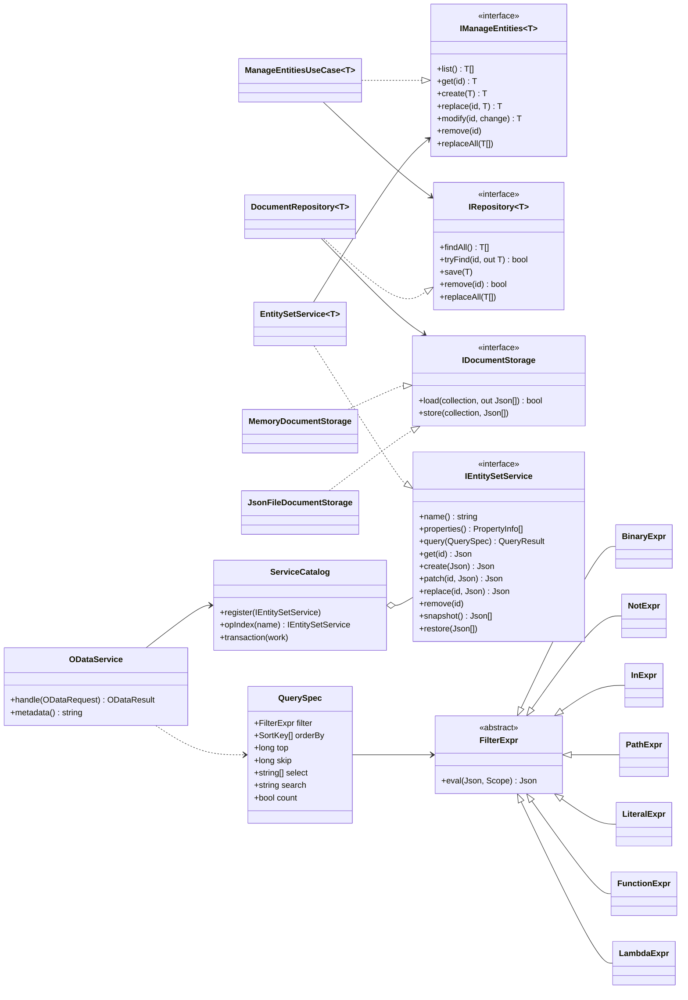
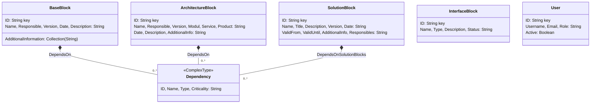
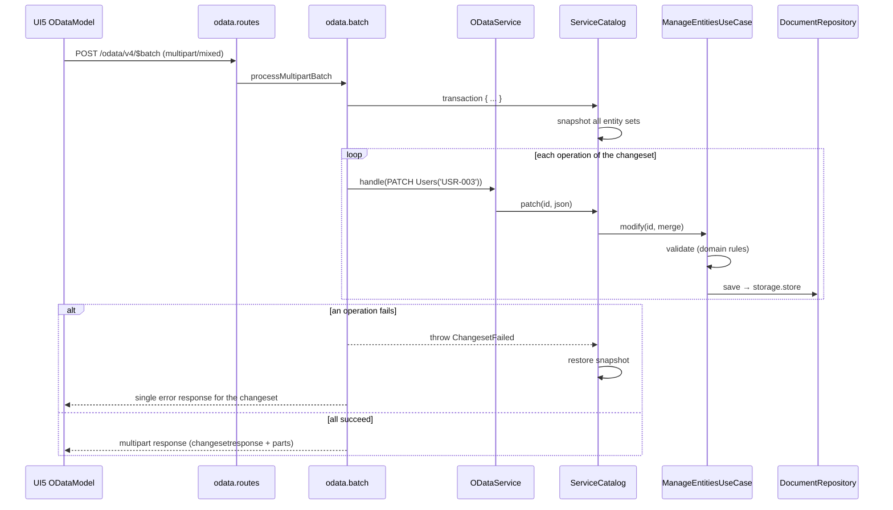

# blocks-odatav4 – UML

## Components (hexagonal architecture)

```mermaid
flowchart LR
  subgraph Clients
    UI5[Fiori / UI5 app<br/>frontend/]
    Shell[Terminal]
    Desk[Desktop user]
  end

  AR[approuter<br/>XSUAA]

  subgraph Presentation["presentation (driving adapters)"]
    OData[odata<br/>ODataService · batch · parser · edm]
    HTTP[http<br/>server · ShellApi]
    CLI[cli<br/>runCli · execute]
    GUI[gui<br/>BlocksWindow · EntityDialog]
  end

  subgraph Application
    Catalog[ServiceCatalog<br/>EntitySetService&lt;T&gt;]
    UC[ManageEntitiesUseCase&lt;T&gt;]
    Query[runQuery · QuerySpec · FilterExpr]
  end

  subgraph Domain
    Ent[Entities<br/>BaseBlock · ArchitectureBlock · SolutionBlock<br/>InterfaceBlock · User · Dependency]
    DS[validate · nextBusinessId]
    Ex[DomainException<br/>NotFound · Validation · Conflict]
  end

  subgraph Ports
    PU[IManageEntities&lt;T&gt;]
    PR[IRepository&lt;T&gt;]
    PS[IDocumentStorage]
    PA[IAuthenticator]
  end

  subgraph Persistence
    Repo[DocumentRepository&lt;T&gt;]
    Mem[MemoryDocumentStorage]
    File[JsonFileDocumentStorage]
  end

  subgraph Infrastructure
    Cfg[AppConfig<br/>file → env → VCAP → CLI]
    Ser[JSON codec]
    Sec[DemoAuthenticator]
    Log[logging]
  end

  Comp((composition<br/>bootstrap))

  UI5 --> AR --> HTTP
  HTTP --> OData
  Shell --> CLI
  Desk --> GUI
  CLI -->|serve| HTTP
  CLI -->|gui| GUI
  OData --> Catalog
  CLI --> Catalog
  GUI --> Catalog
  HTTP --> PA
  Catalog --> PU
  UC -.implements.-> PU
  UC --> PR
  UC --> DS
  Catalog --> Query
  Repo -.implements.-> PR
  Repo --> PS
  Mem -.implements.-> PS
  File -.implements.-> PS
  Sec -.implements.-> PA
  Comp --> Cfg
  Comp --> Repo
  Comp --> UC
  Comp --> Catalog
```

## Classes

```mermaid
classDiagram
  direction LR

  class IManageEntities~T~ {
    <<interface>>
    +list() T[]
    +get(id) T
    +create(T) T
    +replace(id, T) T
    +modify(id, change) T
    +remove(id)
    +replaceAll(T[])
  }
  class IRepository~T~ {
    <<interface>>
    +findAll() T[]
    +tryFind(id, out T) bool
    +save(T)
    +remove(id) bool
    +replaceAll(T[])
  }
  class IDocumentStorage {
    <<interface>>
    +load(collection, out Json[]) bool
    +store(collection, Json[])
  }
  class IEntitySetService {
    <<interface>>
    +name() string
    +properties() PropertyInfo[]
    +query(QuerySpec) QueryResult
    +get(id) Json
    +create(Json) Json
    +patch(id, Json) Json
    +replace(id, Json) Json
    +remove(id)
    +snapshot() Json[]
    +restore(Json[])
  }

  class ManageEntitiesUseCase~T~
  class DocumentRepository~T~
  class MemoryDocumentStorage
  class JsonFileDocumentStorage
  class EntitySetService~T~
  class ServiceCatalog {
    +register(IEntitySetService)
    +opIndex(name) IEntitySetService
    +transaction(work)
  }
  class ODataService {
    +handle(ODataRequest) ODataResult
    +metadata() string
  }
  class QuerySpec {
    +FilterExpr filter
    +SortKey[] orderBy
    +long top
    +long skip
    +string[] select
    +string search
    +bool count
  }
  class FilterExpr {
    <<abstract>>
    +eval(Json, Scope) Json
  }

  ManageEntitiesUseCase ..|> IManageEntities
  ManageEntitiesUseCase --> IRepository
  DocumentRepository ..|> IRepository
  DocumentRepository --> IDocumentStorage
  MemoryDocumentStorage ..|> IDocumentStorage
  JsonFileDocumentStorage ..|> IDocumentStorage
  EntitySetService ..|> IEntitySetService
  EntitySetService --> IManageEntities
  ServiceCatalog o-- IEntitySetService
  ODataService --> ServiceCatalog
  ODataService ..> QuerySpec
  QuerySpec --> FilterExpr
  FilterExpr <|-- BinaryExpr
  FilterExpr <|-- NotExpr
  FilterExpr <|-- InExpr
  FilterExpr <|-- PathExpr
  FilterExpr <|-- LiteralExpr
  FilterExpr <|-- FunctionExpr
  FilterExpr <|-- LambdaExpr
```

## Domain model (OData EDM)

```mermaid
classDiagram
  class BaseBlock {
    ID: String key
    Name, Responsible, Version, Date, Description: String
    AdditionalInformation: Collection(String)
  }
  class ArchitectureBlock {
    ID: String key
    Name, Responsible, Version, Modul, Service, Product: String
    Date, Description, AdditionalInfo: String
  }
  class SolutionBlock {
    ID: String key
    Name, Title, Description, Version, Date: String
    ValidFrom, ValidUntil, AdditionalInfo, Responsibles: String
  }
  class InterfaceBlock {
    ID: String key
    Name, Type, Description, Status: String
  }
  class User {
    ID: String key
    Username, Email, Role: String
    Active: Boolean
  }
  class Dependency {
    <<ComplexType>>
    ID, Name, Type, Criticality: String
  }
  BaseBlock *-- "0..*" Dependency : DependsOn
  ArchitectureBlock *-- "0..*" Dependency : DependsOn
  SolutionBlock *-- "0..*" Dependency : DependsOnSolutionBlocks
```

## Sequence: UI5 `$batch` with a changeset

```mermaid
sequenceDiagram
  participant UI5 as UI5 ODataModel
  participant R as odata.routes
  participant B as odata.batch
  participant S as ODataService
  participant C as ServiceCatalog
  participant U as ManageEntitiesUseCase
  participant P as DocumentRepository

  UI5->>R: POST /odata/v4/$batch (multipart/mixed)
  R->>B: processMultipartBatch
  B->>C: transaction { ... }
  C->>C: snapshot all entity sets
  loop each operation of the changeset
    B->>S: handle(PATCH Users('USR-003'))
    S->>C: patch(id, json)
    C->>U: modify(id, merge)
    U->>U: validate (domain rules)
    U->>P: save → storage.store
  end
  alt an operation fails
    B-->>C: throw ChangesetFailed
    C->>C: restore snapshot
    B-->>UI5: single error response for the changeset
  else all succeed
    B-->>UI5: multipart response (changesetresponse + parts)
  end
```
